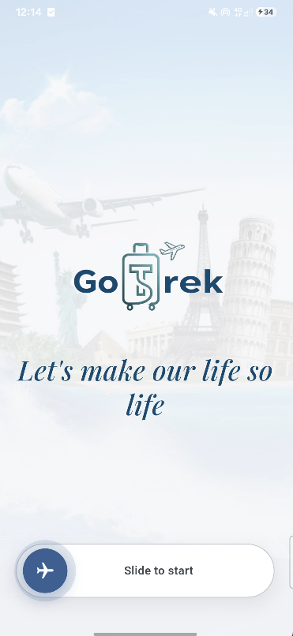
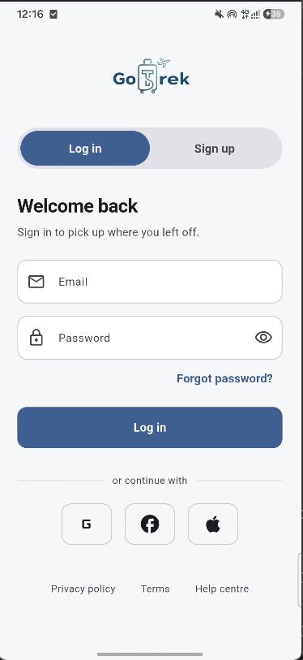
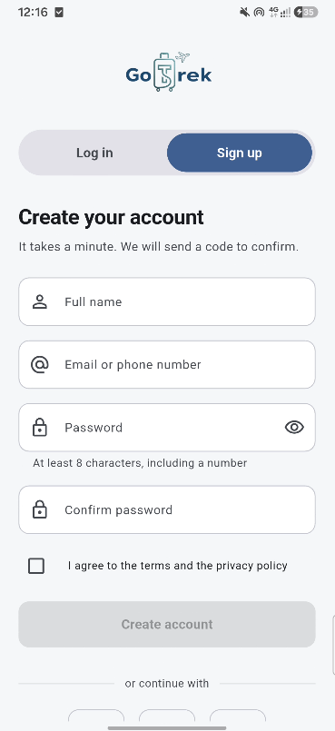
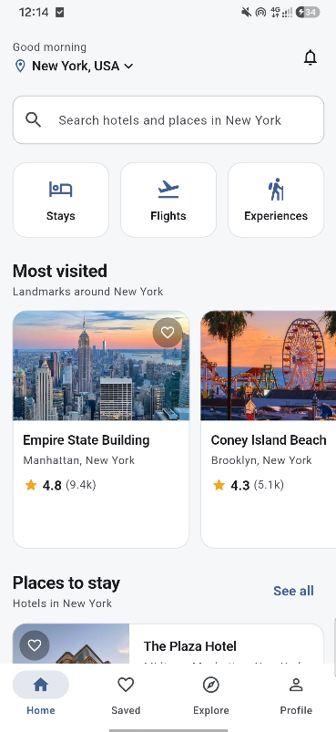
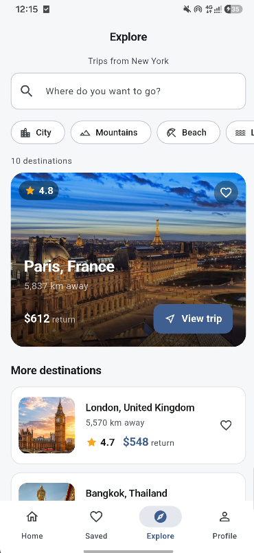
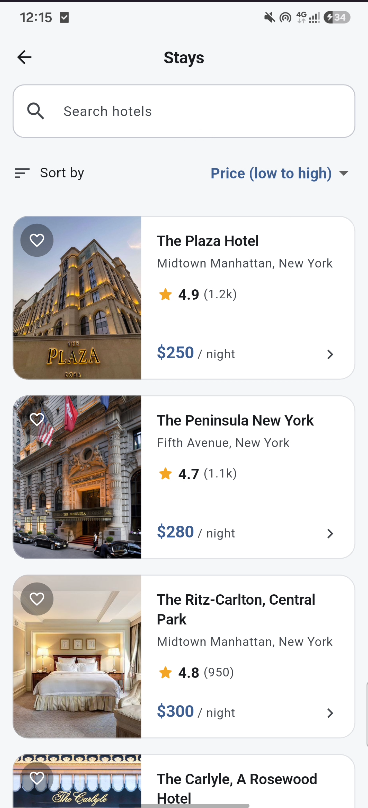
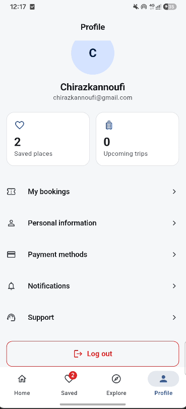

# GoTrek

**A tourism booking app built with Flutter and Riverpod — discover a city, book a stay, plan the trip.**

### Demo

<video src="docs/screenshots/demo.mp4" controls muted playsinline width="320"></video>

▶︎ **[Watch the 40-second demo](docs/screenshots/demo.mp4)** — a full pass through the app: welcome, home, search, explore, stays and booking.

---

## Overview

GoTrek centralises the things a traveller needs into one app. The home screen is about **where you are** — the hotels, landmarks and activities in your current city, searchable in place. The Explore tab is about **where you might go**: the world's most-visited destinations, each with a return trip you can price and book. A separate departures board lists the flights leaving your airport today. Everything is browsable without an account; signing in is only asked for when an action genuinely belongs to one, such as saving a place or completing a booking.

The project began as a final-year group project for the *Licence en Systèmes Informatiques* at **Université Ferhat Abbas Sétif 1 (2025)**, built by a team of four. The original submission covered the requirements analysis, UML modelling, a PostgreSQL schema and a first Flutter prototype of the screens.

It was later refactored into the portfolio-quality prototype in this repository: the flat screen files became a layered architecture, the hardcoded lists inside widgets became typed models behind a repository layer, Riverpod replaced ad-hoc `setState`, and a test suite was added. The app is **frontend-complete and backend-pending** — the data comes from a local seeded catalogue designed to be swapped for a real API without touching the UI. The [Current state](#current-state) section is explicit about what is and is not real.

---

## Screenshots

| | | |
|:---:|:---:|:---:|
|  |  |  |
| **Welcome** — brand tagline over a softened backdrop, with a slide-to-start control whose aeroplane knob pulses while idle and takes off on release. | **Log in** — segmented log in / sign up switch, validated email and password fields with a visibility toggle. | **Sign up** — full name, email or phone, password rules enforced inline, and a terms checkbox that gates the submit button. |
|  |  |  |
| **Home** — your current city: a location picker, in-city search, service shortcuts, and rails of landmarks and hotels. | **Explore** — trips away from your city: ten world destinations with category filters, a hero card and return fares. | **Stays** — hotel list with live search and a working sort by price or rating, showing ratings, review counts and nightly rates. |
|  | | |
| **Profile** — signed-in account with saved-place and upcoming-trip counts, bookings, and settings entries. | | |

---

## Features

Everything listed here works in the app as it stands.

- **Guest browsing** — the whole app is usable without an account. A sign-in prompt appears only for account actions (saving, booking, viewing your bookings), and the interrupted action resumes automatically once you are signed in.
- **Home, scoped to your city** — landmarks, hotels and activities for the selected city, with a search box that filters within that city rather than redirecting elsewhere, and a location picker in the app bar.
- **Explore, scoped to everywhere else** — ten of the world's most-visited destinations with search, category filters, distances and return fares. Your current city is deliberately excluded so the two tabs never mirror each other.
- **Stays** — searchable hotel list with a working sort (price ascending or descending, top rated); detail pages with facilities, an expandable description, a date-range picker and a room stepper.
- **Flights** — a departures board of today's flights from your airport, with times, durations, fares, seats remaining, and a traveller stepper before checkout.
- **Experiences** — guided tours and activities with duration, next available date and a guest stepper.
- **Booking flow** — an itemised price breakdown with a service fee, payment-method selection, and a confirmation screen with a generated booking reference. Confirmed bookings are listed under the profile and can be cancelled.
- **Favourites** — save destinations, stays, experiences and landmarks; persisted on the device and surfaced as a badge on the navigation bar.
- **Throughout** — loading, empty and error states on every asynchronous view; a light Material 3 theme; layouts that adapt from phone to desktop widths.

---

## Tech stack

| Layer | Technology | Status |
|---|---|---|
| Framework | Flutter 3.29 | Implemented |
| Language | Dart 3.7 | Implemented |
| State management | Riverpod (`flutter_riverpod`) | Implemented |
| Local persistence | `shared_preferences` | Implemented |
| Design system | Material 3 | Implemented |
| Formatting | `intl` | Implemented |
| Design | Figma | Implemented |
| Backend API | Node.js | Specified, not implemented |
| Database | PostgreSQL | Schema written, no live instance |
| Hosting | Firebase | Specified, not implemented |

The Node.js backend, PostgreSQL database and Firebase hosting are specified in the [cahier des charges](docs/cahier_des_charges.pdf) but have not been built. The app currently reads from a local mock catalogue behind a repository layer, which exists precisely so it can be replaced by a real API client without changes to the UI.

---

## Architecture

The code is organised in layers, and screens never reach a data source directly. `app/` holds the `MaterialApp`, the route table and the bottom-navigation shell. `core/` holds cross-cutting concerns — the theme tokens, formatters, validators and the shared widget library. `data/` holds the typed models, the seeded catalogue and the repositories that expose it. `state/` holds the Riverpod providers and controllers that mediate between the two. `features/` holds one folder per screen area, each consuming providers rather than repositories. The data path is `SeedCatalog → CatalogRepository → provider → screen`, so introducing an HTTP client is a change confined to the repository layer.

---

## Getting started

**Prerequisites** — Flutter SDK 3.29 or newer (Dart 3.7+). Verify your install with `flutter doctor`.

Clone the repository and fetch dependencies:

```bash
flutter pub get
```

Run the app on a connected device, emulator or desktop target:

```bash
flutter run
```

Run the test suite:

```bash
flutter test
```

Run the static analyzer:

```bash
flutter analyze
```

Both gates are clean. `analysis_options.yaml` promotes unused imports, dead code and deprecated API use from warnings to **errors**, so a failing analyzer run means the build is genuinely broken rather than merely untidy.

---

## Project structure

```
GoTrek/
├── lib/          Application source: app shell, core utilities and theme,
│                 data layer, Riverpod state, and one folder per feature.
├── assets/       Destination and hotel photography, the logo, and the
│                 bundled display typeface used by the welcome tagline.
├── docs/         Requirements document, UML diagrams, screenshots and demo.
├── database/     PostgreSQL schema for the intended backend.
└── test/         Unit, controller, widget and end-to-end widget tests.
```

---

## Documentation

- [Cahier des charges (full specification)](docs/cahier_des_charges.pdf) — **the maintained version**: cover, table of contents, numbered sections, each UML diagram on its own page, and an annexe recording the current state of the app. `docs/cahier_des_charges.tex` is the original LaTeX source and is no longer kept in sync with it.
- [Use case diagram](docs/diagrams/use_case_diagram.png) — interactions between the four actors and the system.
- [Class diagram](docs/diagrams/class_diagram.png) — system entities and their relationships.
- [Sequence diagram — tourist flow](docs/diagrams/sequence_diagram_tourist.png) — search, availability check and booking confirmation.
- [Sequence diagram — service providers flow](docs/diagrams/sequence_diagram_providers.png) — provider sign-in and offer publication.

---

## Current state

To be precise about what is and is not real:

- **No backend server.** `database/schema.sql` defines the intended data model, but nothing serves it.
- **Data is seeded locally.** `lib/data/seed/seed_catalog.dart` holds the catalogue. Repositories return it behind a small artificial delay so the loading states are genuinely exercised, and trip dates are generated relative to today so nothing is advertised in the past.
- **One city has local content.** New York is populated; the location picker lists other cities but marks them unavailable rather than pretending otherwise.
- **Authentication is local.** Any well-formed email and password opens a session; there is no credential store and no OAuth2 or JWT yet. The sign-up confirmation code is generated on the device and shown on screen because there is no SMS gateway — the check itself is real, and a wrong code is rejected.
- **Payment is not processed.** Selecting a card and confirming stores a booking locally; no payment provider is contacted, and no card numbers are captured or stored anywhere.
- **Some controls are deliberately inert.** Social sign-in, notifications and support are part of the design but have nothing behind them; they say so when tapped rather than doing nothing.

Favourites, bookings and the session persist through `shared_preferences`, so they survive a restart on the device.

---

## Roadmap

What would be required to take this from prototype to production:

1. **Node.js REST API** over the entities in `database/schema.sql`.
2. **PostgreSQL instance** created from that schema and connected to the API.
3. **Real authentication** — JWT issuance and refresh, replacing the local session, plus a credential store.
4. **SMS gateway** so the sign-up confirmation code is actually delivered.
5. **Payment gateway** for checkout.
6. **Multi-city content** so the location picker is backed by real data beyond New York.
7. **Server-side favourites and bookings**, so they follow the account rather than the device.

---

## Credits

Final-year group project for the *Licence en Systèmes Informatiques*, **Université Ferhat Abbas Sétif 1**, 2025.

Built by a team of four:

- Kannoufi Chiraz Lina
- Benarab Dhiaa El Din
- Bouzidi Hichem
- Rouag Younes

Produced for academic assessment and retained as a portfolio piece. The bundled Playfair Display typeface is used under the [SIL Open Font License 1.1](assets/fonts/OFL.txt).
